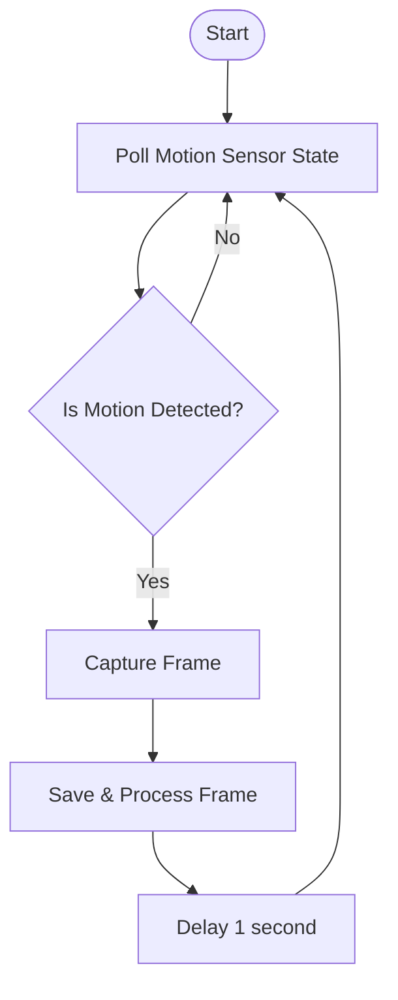

# SOC Project - Week 1 Technical Notes

This document summarizes the core logic, testing patterns, and architecture structures required for the development of our automated computer vision pipeline.

---

## 1. Camera Logic & Image Filtering

### 1.1 Motion-Activated Camera Flowchart

To minimize storage and computing costs, the camera runs on an event-driven loop that only triggers a capture frame when motion is detected.



### 1.2 Image Analysis Pre-Filtering Algorithm

Before routing an image to a heavy Object Detection / Classification model, we run a lightweight filtering algorithm to discard unviable or static images.

1. **Format & Integrity Check:** Ensure the frame is fully loaded and file properties (e.g., height, width) are greater than zero.
2. **Exposure Check:** Analyze average pixel brightness. If the image is extreme (e.g., mean pixel value $< 10$ or $> 245$), mark as unreadable and terminate the pipeline.
3. **Frame Differencing:** Calculate the absolute pixel-by-pixel difference between the current frame and a cached reference frame (taken during a known static interval).
4. **Analysis Decision:**
   * If the absolute pixel variance exceeds a threshold limit (e.g., $>2\%$ of total pixels changed), flag the frame status as `Needs Analysis` and forward it to the inference step.
   * Otherwise, flag as `Static` and discard.

---

## 2. Testing with Pytest

### 2.1 Core Concepts
* **Test Isolation:** Pytest automatically runs functions prefixed with `test_` found in files named `test_*.py`.
* **Assert Statements:** Relies on standard Python assertions (`assert a == b`) rather than custom boilerplate methods.

### 2.2 Implementation Example
Below is an implementation of a detection filter and its corresponding Pytest test.

```python
# detection.py
def filter_detections(detections: list, threshold: float) -> list:
    """Filters out any detections that do not meet the minimum confidence threshold."""
    return [d for d in detections if d.get("confidence", 0.0) >= threshold]

# test_detection.py
from detection import filter_detections

def test_filter_detections_normal_case():
    sample_data = [
        {"label": "person", "confidence": 0.92},
        {"label": "dog", "confidence": 0.45},
        {"label": "car", "confidence": 0.12}
    ]
    # Filter anything below 0.50 confidence
    result = filter_detections(sample_data, 0.50)
    
    assert len(result) == 1
    assert result[0]["label"] == "person"

def test_filter_detections_empty_list():
    assert filter_detections([], 0.5) == []
```

## 3. TypeScript Transition
### 3.1 Core Concepts
Type Safety: Prevents runtime errors by checking object structures at compile time.
Union Types: Standardizes specific allowed states rather than using arbitrary string variables.
### 3.2 Transitioning JS Objects to TS Types
Below is a conversion mapping a dynamic Javascript pipeline state into strict TypeScript definitions.
```typescript
// 1. Define valid pipeline statuses
export type PipelineStatus = 'waiting' | 'running' | 'completed' | 'failed';

// 2. Define the structure of a bounding box coordinates
export type BoundingBox = [number, number, number, number]; // [x, y, width, height]

// 3. Define individual detection instances
export interface Detection {
  id: string;
  label: string;
  confidence: number;
  box: BoundingBox;
}

// 4. Define the primary pipeline state object
export interface PipelineState {
  currentStage: PipelineStatus;
  detections: Detection[];
  lastInferenceTimeMs: number | null;
  error?: string; // Optional field
}
```

## 4. Frontend Tooling with Vite
### 4.1 Core Concepts
ES Modules (ESM): Vite serves source code over native ESM, eliminating the need to rebundle the entire app on every file change.
HMR (Hot Module Replacement): Updates code in the browser instantly without losing current application state.

When a user clicks a button inside your live app and a piece of state changes, React uses its Virtual DOM to figure out exactly which HTML elements need to change. It updates only that specific part of the screen without refreshing the page.

Vite uses an incredibly fast engine called esbuild to instantly compile your JSX into standard JS the second you hit save.

For production, it takes hundreds of your separate code files, optimizes them, removes unused code (tree-shaking), and minifies them into a few highly compact files.

You cannot just double-click an index.html file on your computer to run a modern web app properly; security restrictions will block features like routing or fetching data. You need a local web server to "host" your files while you develop.

Vite spins up a lightweight, ultra-fast local server (usually http://localhost:5173).

HMR does not compare the DOM tree. Comparing the DOM tree is React's job.


## 5. State Management with Zustand
### 5.1 Core Concepts
No Boilerplate: Zustand does not require wrapping your React app in Context Providers.
Single Hook Store: State and state-mutating functions (actions) are kept together in a single custom React hook.
### 5.2 Implementation Example
This store controls the state of the image pipeline and allows components to subscribe to updates.

```typescript
import { create } from 'zustand';
import { PipelineStatus, Detection } from './types'; // Assuming types defined above

interface PipelineStore {
  status: PipelineStatus;
  detections: Detection[];
  startPipeline: () => void;
  setDetections: (newDetections: Detection[]) => void;
  resetPipeline: () => void;
}

export const usePipelineStore = create<PipelineStore>((set) => ({
  status: 'waiting',
  detections: [],
  
  startPipeline: () => set({ status: 'running' }),
  
  setDetections: (newDetections) => set({ 
    detections: newDetections, 
    status: 'completed' 
  }),
  
  resetPipeline: () => set({ 
    status: 'waiting', 
    detections: [] 
  })
}));
```

```typescript
import React from 'react';
import { usePipelineStore } from './store';

export const PipelineControlPanel: React.FC = () => {
  const status = usePipelineStore((state) => state.status);
  const startPipeline = usePipelineStore((state) => state.startPipeline);

  return (
    <div className="card">
      <h3>System Status: {status.toUpperCase()}</h3>
      <button 
        disabled={status === 'running'} 
        onClick={startPipeline}
      >
        Run Diagnostics
      </button>
    </div>
  );
};
```

##Block based programming
*   **Block:** A visible, modular operation or step (e.g., "Send Email", "Resize Image").
*   **Port:** An input or output slot on a block.
    *   *Input Ports:* Receive incoming data or signals.
    *   *Output Ports:* Emit processed data or signals.
*   **Connection:** The line/wire connecting an output port of one block to the input port of another. This represents the flow of data.
*   **Configuration:** Adjusts the internal variables or parameters of a block without changing its core logic (e.g., setting a threshold, picking a file path).
*   **Handler:** The underlying code (e.g., Python, JavaScript) that executes the actual work when the block is triggered.


### 2. Example: Object Detector Block

Below is a breakdown of how a machine learning task maps to this architecture:

*   **Block Name:** Object Detector
*   **Input Port:** `image` (expects raw image data or a file path)
*   **Output Port:** `detections` (outputs an array/JSON of labels, coordinates, and confidence levels)
*   **Configuration:**
    *   `model_name` (e.g., YOLO, MobileNet)
    *   `confidence_threshold` (e.g., `0.5`)
    *   `image_size` (e.g., `640x640`)
*   **Handler Logic:**
    1. Retrieve the incoming image from the `image` port.
    2. Read configuration parameters (`model_name`, `confidence_threshold`, `image_size`).
    3. Resize the image.
    4. Pass the image to the selected model to detect objects.
    5. Filter out results below the confidence threshold.
    6. Send the filtered list to the `detections` output port.

---

### 3. Tool Ecosystem & When to Use What

Different tools solve different parts of the block-based design puzzle.

#### A. Node-RED (Backend Execution & Automation)
*   **Purpose:** Building and running live data pipelines, API connections, and automations.
*   **Characteristics:**
    *   Browser-based visual editor out of the box.
    *   Runs on a Node.js backend.
    *   Ideal for quickly connecting hardware devices (IoT), web services, and APIs.
*   **Quick Setup Command:**
    ```bash
    npm install -g --unsafe-perm node-red
    node-red
    # Access via http://localhost:1880
    ```

#### B. React Flow / Svelte Flow (Frontend Graph UI)
*   **Purpose:** Building a custom node-editor interface in your own web applications.
*   **Characteristics:**
    *   Highly customizable library for rendering nodes, handles (ports), and draggable edges (connections).
    *   Does *not* handle execution backend logic; it is purely a visual UI framework.
*   **Quick Setup Command:**
    ```bash
    npm install @xyflow/react
    ```

#### C. Google Blockly (Block-Based Code Generation)
*   **Purpose:** Creating visual, puzzle-like block programming interfaces (similar to Scratch) that generate raw text-based code.
*   **Characteristics:**
    *   Blocks lock together physically to represent logical structures (loops, conditionals, variables).
    *   Outputs clean, executable JavaScript, Python, PHP, Dart, or Lua code.
    *   Widely used in educational games, toys, and developer portals.


## 1. Core Graph Theory Concepts

When a user designs a workflow visually, they are drawing a mathematical construct known as a **graph**.

*   **Graph:** A structure consisting of a set of points and the lines connecting them.
*   **Nodes (Vertices):** In workflow design, these represent individual **blocks** (e.g., Load Image, Save File).
*   **Edges (Links):** These represent the **connections** (wires) carrying data or execution signals from one block's port to another.
*   **Directed Graph:** A graph where edges have a defined direction (represented by arrows). In a workflow, data flows unidirectionally from an output port to an input port.
*   **Directed Acyclic Graph (DAG):** A directed graph with no closed loops (cycles). A workflow must be a DAG to ensure execution can start, progress, and terminate without getting caught in an infinite loop.

---

### Topological Sorting with Kahn's Algorithm

To execute a DAG, the system must convert the network of blocks into a linear, step-by-step sequence. This process is called **topological sorting**. A valid topological sort ensures that no block is executed before its dependency requirements (inputs) are fully processed.

### How Kahn's Algorithm Works

Kahn's algorithm relies on tracking **children** (through an adjacency list) and keeping a count of **parents** (known as the *in-degree* of a node).

1.  **In-Degree Calculation:** Count the incoming edges for every node. A node with an in-degree of `0` has zero dependencies.
2.  **Initialize Queue:** Locate all nodes with an in-degree of `0` and place them in a queue.
3.  **Process Queue:**
    *   Pop a node from the queue and place it into the final sorted list.
    *   For each of its child nodes, decrement their in-degree count by `1`.
    *   If any child's in-degree drops to `0`, push it to the queue.
4.  **Cycle Check:** If the sorted list does not contain all nodes from the graph, a cycle exists, and execution must be halted.


## Computer vision fundamentals
### **opencv/01_vision_basics.py**
- using *opencv*
- reading writing showing images
- crop, resize, grayscale, equalize, thresholding on images
### **opencv/02_enhancement.py**
- Creating images with noise
- Applying filters (blur, sharpen, etc.)
- preprocessing - canny edges
- normalization
### **opencv/03_detector.py**
- using *YOLO* to detect images
- bounding boxes, confidence threshold, IoU
### **opencv/04_ocr_reader.py**
- using *pytesseract* to read text from images
- grayscale, blur, thresholding works well
### **opencv/05_tracker_and_logic.py**
- tracking multiple frames at once
- calculating centroid and then distance between object in current frame and previous frame
### **opencv/main_pipeline.py**
- integrating all components in a single pipeline
- taking a single image, creating new images from that by shifting objects
